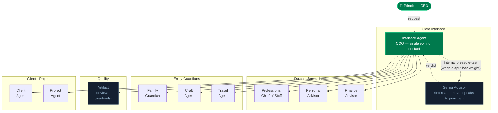
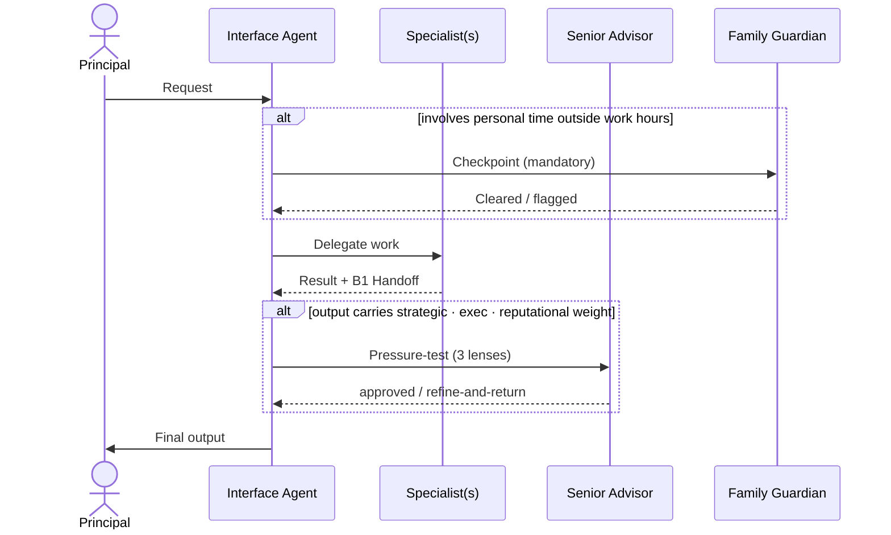
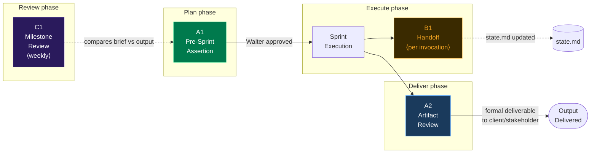
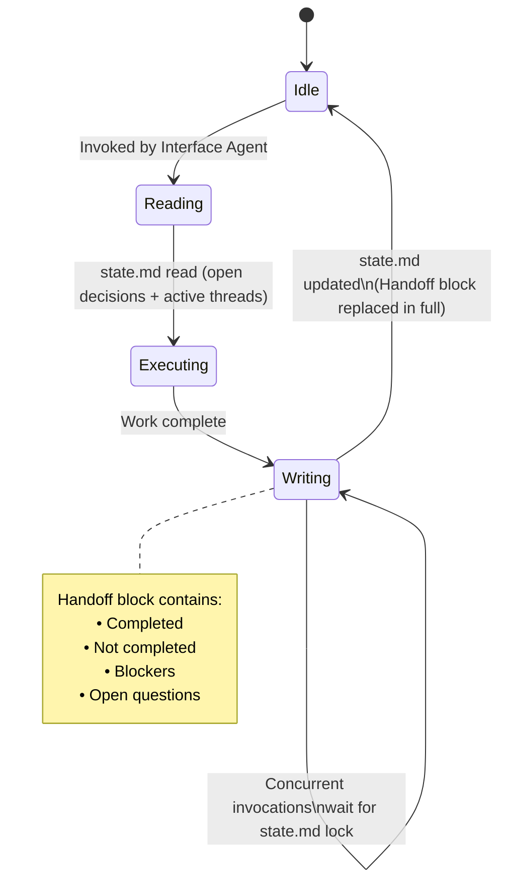

# agentic-os — Architecture

> Visual reference for the system design. For operational setup, see `control-plane/CLAUDE.md` and `control-plane/session-start.md`.

---

## 1. Agent Hierarchy

---

## 2. Canonical Flow

> **Rule:** Senior Advisor never delivers output to the Principal. Family Guardian runs before any output that consumes personal time.

---

## 3. Quality Gates Pipeline

| Gate | When | Who | Exception |
|------|------|-----|-----------|
| **A1** Pre-Sprint Assertion | Before any planned sprint | Chief of Staff drafts brief → Walter reviews | Reactive urgent execution skips A1; A2 covers output at end |
| **A2** Artifact Review | Before formal deliverable to client/stakeholder | Artifact Reviewer (read-only) | Drafts, code, internal notes excluded |
| **B1** Structured Handoff | End of every agent invocation | Each agent writes to `state.md` | None |
| **C1** Milestone Review | Weekly | Interface Agent | None |

---

## 4. Memory Architecture

```mermaid
flowchart TB
    subgraph T1 ["Tier 1 — Structural · Identity (permanent)"]
        SELF["memory/self/\npersonality · decision-rules\ncommunication-style · boundaries"]
        IA["memory/&lt;interface-agent&gt;/\nmandate · delegation · execution\nreporting-rules"]
        SA["memory/&lt;senior-advisor&gt;/\nmandate · judgment-model\nescalation-rules · personality"]
    end

    subgraph T2 ["Tier 2 — Auto-Memory (cross-session persistent)"]
        IDX["memory/auto/MEMORY.md\n(index file)"]
        TOPIC["memory/auto/&lt;topic&gt;.md\nuser profile · operating mode\nclient context · working patterns…"]
    end

    subgraph T3 ["Tier 3 — Operational (session-scoped)"]
        DAILY["memory/daily/YYYY-MM-DD.md"]
        DEC["memory/decisions/decision-log.md"]
        STATE["memory/&lt;agent&gt;/state.md\n(B1 handoff blocks)"]
    end

    HOOK(["SessionStart Hook"])
    K_AGENT["Interface Agent"]

    HOOK -->|"injects at session open"| T2
    T2 --> K_AGENT
    T1 -->|"read on demand"| K_AGENT
    T3 -->|"read by agents as needed"| K_AGENT

    style HOOK fill:#1A3A5C,stroke:#4A9EFF,color:#fff
    style T1 fill:#0A1A0F,stroke:#007A4D
    style T2 fill:#0A1520,stroke:#1A3A5C
    style T3 fill:#1A1500,stroke:#3A2A00
```

### Source-of-truth split

| Category | Owner |
|----------|-------|
| Structural / Identity (rules, memory, agent specs) | This repo (Tier 1 + Tier 2) |
| Operational (projects, tasks, notes, reviews) | External system (Notion, Linear, etc.) |
| Code | Git repos |
| Raw evidence | Original files (SharePoint, email, etc.) |

---

## 5. Domain Structure

```mermaid
flowchart LR
    K["Interface\nAgent"]

    subgraph Active ["Active domains"]
        PRO["Professional\n· Chief of Staff\n· Client Agents\n· Project Agents\n· Artifact Reviewer"]
        PER["Personal\n· Personal Advisor\n· Family Guardian\n· Craft Agent\n· Travel Agent"]
        FIN["Finance\n· Finance Advisor"]
    end

    subgraph Planned ["Expandable domains"]
        INV["Investments\n· CIO\n· 10 school agents\n· 4 advisory modules"]
        SPI["Spiritual\n· CTE\n· 25 specialist agents"]
        LRN["Learning\n· Learning Curator"]
    end

    K --> PRO & PER & FIN
    K -.->|"expansion\nsequence"| INV & SPI & LRN

    style PRO fill:#0A1A0F,stroke:#007A4D
    style PER fill:#0A1A0F,stroke:#007A4D
    style FIN fill:#0A1A0F,stroke:#007A4D
    style INV fill:#152030,stroke:#2A4460
    style SPI fill:#152030,stroke:#2A4460
    style LRN fill:#152030,stroke:#2A4460
```

> Expansion is governed by `control-plane/rules/post-mvp-expansion-directive.md`. New domains are added one at a time after the previous one is stable.

---

## 6. Agent State Lifecycle (B1 Handoff)

---

## Design principles

| Principle | Rationale |
|-----------|-----------|
| **Single interface** — one agent fronts all work | Prevents context fragmentation; principal never manages agent-to-agent routing |
| **Senior Advisor is internal** | Internal pressure-testing is a different cognitive act than delivering. Mixing both in one agent produces softer outputs |
| **Entity guardians as hard gates** | Some things are not resources to optimize — they are structural priorities. The guardian surfaces every proposal that quietly draws from that account |
| **Agentic-by-default** | Sub-agents are the default for non-trivial work. Simulated invocation (internal reasoning only) is the exception |
| **Memory in tiers** | Identity (T1) never changes without instruction. Operating context (T2) persists automatically. Execution state (T3) is ephemeral and never authoritative for identity |
| **Quality gates before and after** | A1 gates execution (brief must be approved before work starts). A2 gates delivery (artifact must conform to brief before leaving the system) |
