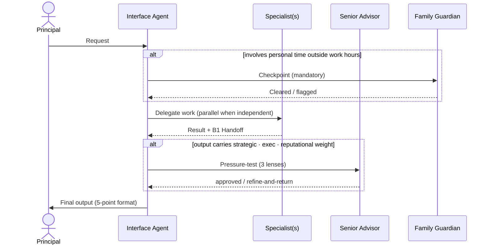
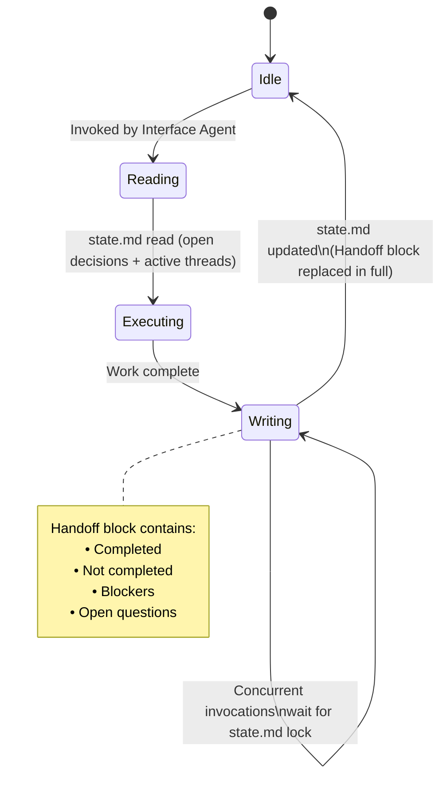

# agentic-os — Architecture

> Visual reference for the system design. For operational setup, see `control-plane/CLAUDE.md` and `control-plane/session-start.md`.

---

## 1. Agent Hierarchy

---

## 2. Canonical Flow

> **Rule:** Senior Advisor never delivers output to the Principal. Family Guardian runs before any output that consumes personal time. B1 Handoff is written after every agent invocation — no exceptions.

---

## 3. Quality Gates Pipeline

| Gate | When | Who | Exception |
|------|------|-----|-----------|
| **A1** Pre-Sprint Assertion | Before any planned sprint | Chief of Staff drafts brief → Senior Advisor reviews | Reactive urgent execution skips A1; A2 covers output at end |
| **A2** Artifact Review | Before formal deliverable to client/stakeholder | Artifact Reviewer (read-only) | Drafts, code, internal notes excluded |
| **B1** Structured Handoff | End of every agent invocation | Each agent writes to `state.md` | None |
| **C1** Milestone Review | Weekly | Interface Agent | None |
| **D1** Model Assignment | Infrastructure setup | Interface Agent | Default: no global model override — targeted assignments only where measurable gain exists |

---

## 4. Memory Architecture

### Source-of-truth split

| Category | Owner |
|----------|-------|
| Structural / Identity (rules, memory, agent specs) | This repo (Tier 1 + Tier 2) |
| Operational (projects, tasks, notes, reviews) | External system (Notion, Linear, etc.) |
| Code | Git repos |
| Raw evidence | Original files (SharePoint, email, etc.) |

---

## 5. Domain Structure

```mermaid
flowchart LR
    K["Interface\nAgent"]

    subgraph Active ["Active domains (all 6)"]
        PRO["Professional\n· Chief of Staff\n· Client Agents\n· Project Agents\n· Codebase Agents\n· Artifact Reviewer"]
        PER["Personal\n· Personal Advisor\n· Family Guardian ⟨hard gate⟩\n· Craft Agent\n· Travel Agent"]
        FIN["Finance\n· Finance Advisor\n· Investigative posture"]
        INV["Investments\n· Investment Advisor\n· CIO Suite\n· 10 school agents\n· 4 advisory modules"]
        SPI["Spiritual\n· Spiritual Guide\n· CTE Suite\n· 25 specialist agents"]
        LRN["Learning\n· Learning Curator\n· TL Pipeline\n· 12 writing agents"]
    end

    K --> PRO & PER & FIN & INV & SPI & LRN

    style PRO fill:#0A1A0F,stroke:#007A4D
    style PER fill:#0A1A0F,stroke:#007A4D
    style FIN fill:#0A1A0F,stroke:#007A4D
    style INV fill:#0A1A0F,stroke:#007A4D
    style SPI fill:#0A1A0F,stroke:#007A4D
    style LRN fill:#0A1A0F,stroke:#007A4D
```

> All 6 domains active in Controlled Scale-Up mode. Expansion governed by `control-plane/rules/post-mvp-expansion-directive.md` — sequential activation, one domain at a time after previous is stable.

---

## 6. Agent State Lifecycle (B1 Handoff)

---

## 7. OS Governance (Darwin Loop)

### Darwin accumulator schema (light mode — runs at SessionStop)

| Field | Description |
|-------|-------------|
| `session` | Session ID |
| `date` | YYYY-MM-DD |
| `ts` | UTC timestamp |
| `agents_invoked` | Unique agents called this session |
| `violations` | Pre-tool-use enforcement fire count |
| `violation_matchers` | Which matchers fired |
| `domains_touched` | Derived from agents invoked |
| `duration_min` | Minutes from first agent call to session end (UTC-corrected) |
| `notes` | Free text, populated in deep mode |

> `tasks_opened` / `tasks_closed` are deep-mode-only — require Notion query. Not in light-mode schema.

---

## Design principles

| Principle | Rationale |
|-----------|-----------|
| **Single interface** — one agent fronts all work | Prevents context fragmentation; principal never manages agent-to-agent routing |
| **Senior Advisor is internal** | Internal pressure-testing is a different cognitive act than delivering. Mixing both in one agent produces softer outputs |
| **Entity guardians as hard gates** | Some things are not resources to optimize — they are structural priorities. The guardian surfaces every proposal that quietly draws from that account |
| **Agentic-by-default** | Sub-agents are the default for non-trivial work. Simulated invocation (internal reasoning only) is the exception, enumerated explicitly |
| **Memory in tiers** | Identity (T1) never changes without instruction. Operating context (T2) persists automatically. Execution state (T3) is ephemeral and never authoritative for identity |
| **Quality gates before and after** | A1 gates execution (brief approved before work starts). A2 gates delivery (artifact conforms to brief before leaving the system). B1 ensures no invocation is lost |
| **Darwin governance loop** | OS Analyst observes the system over time. Proposals flow through Senior Advisor before reaching Principal. Decision-log closes the loop — Darwin reads past decisions to detect drift between what was decided and what was executed |
| **Decision log as structural memory** | Every Senior-Advisor-approved strategic decision is logged with date, domain, decision, and implementation status. Without it, governance is opaque and Darwin rebuilds context from scratch each cycle |
