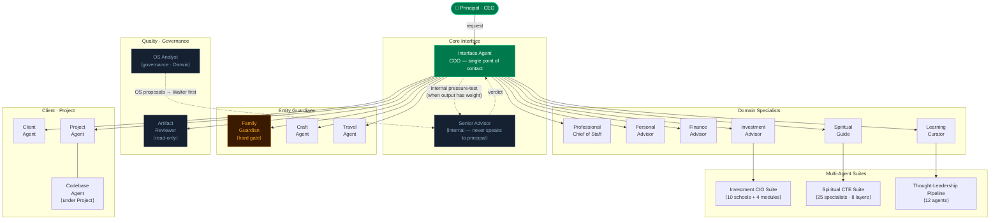
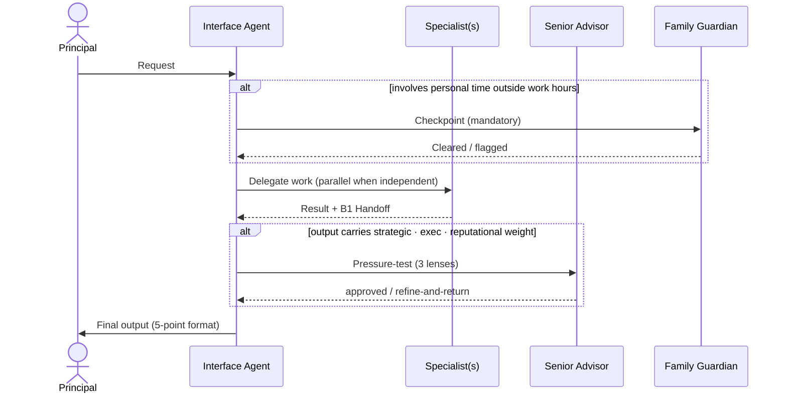
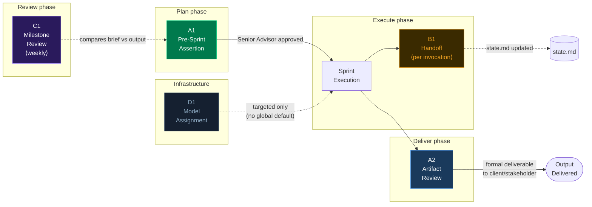
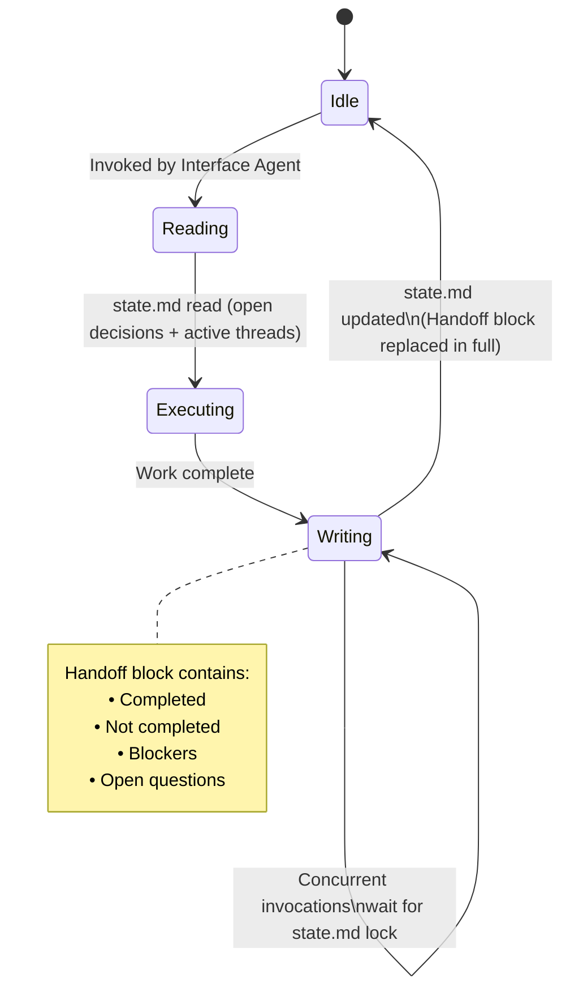
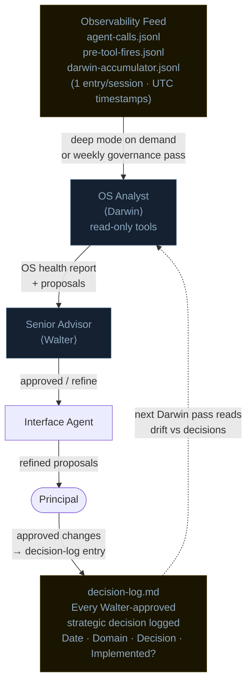
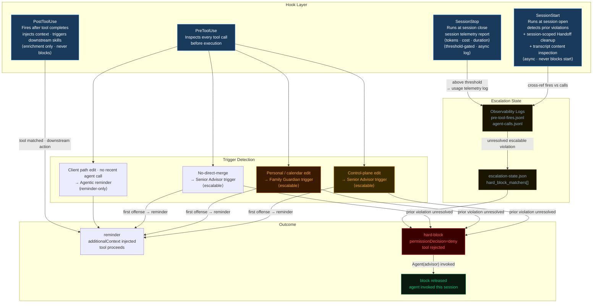
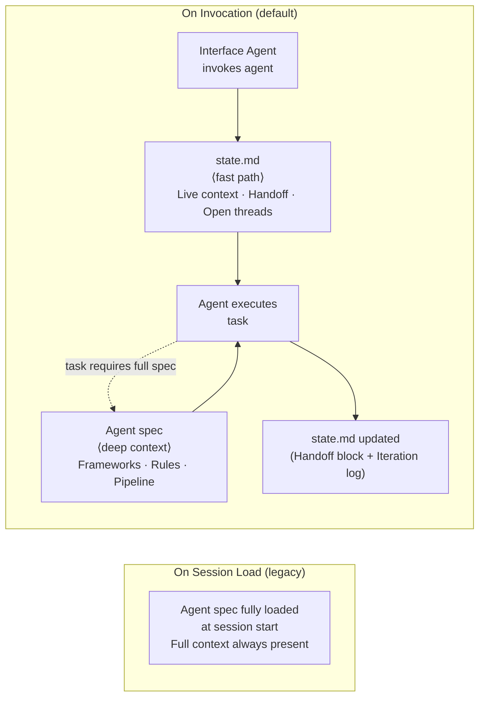
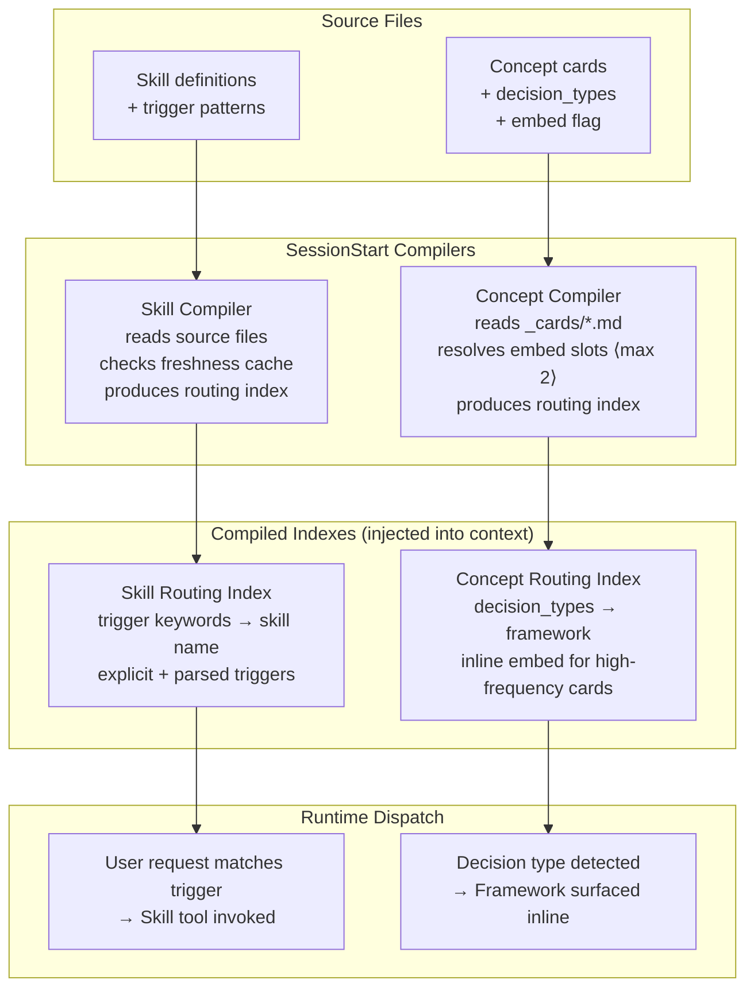

# 🏗️ agentic-os — Architecture

### Visual reference for the system design

[← Back to README](README.md) · [Done Contract](DONE_CONTRACT.md) · [Evolution](EVOLUTION.md) · [Contributing](CONTRIBUTING.md)

> 📖 This document is the **canonical reference** for how the system is shaped. For operational setup, see [`control-plane/CLAUDE.md`](control-plane/CLAUDE.md) and [`control-plane/session-start.md`](control-plane/session-start.md).

---

## 📑 Table of contents

1. [🤖 Agent Hierarchy](#1-agent-hierarchy)
2. [🔄 Canonical Flow](#2-canonical-flow)
3. [🚦 Quality Gates Pipeline](#3-quality-gates-pipeline)
4. [🧠 Memory Architecture](#4-memory-architecture)
5. [🌐 Domain Structure](#5-domain-structure)
6. [📝 Agent State Lifecycle (B1 Handoff)](#6-agent-state-lifecycle-b1-handoff)
7. [🧬 OS Governance (Darwin Loop)](#7-os-governance-darwin-loop)
8. [🛡️ Enforcement Layer (Agentic-by-Default)](#8-enforcement-layer-agentic-by-default)
9. [⚡ Agent Activation Model (On Invocation)](#9-agent-activation-model-on-invocation)
10. [🗂️ Dispatch Compilation Layer](#10-dispatch-compilation-layer)
11. [✨ Design Principles](#design-principles)

---

## 🤖 1. Agent Hierarchy

---

## 🔄 2. Canonical Flow

> **Rule:** Senior Advisor never delivers output to the Principal. Family Guardian runs before any output that consumes personal time. B1 Handoff is written after every agent invocation — no exceptions.

---

## 🚦 3. Quality Gates Pipeline

| Gate | When | Who | Exception |
|------|------|-----|-----------|
| **A1** Pre-Sprint Assertion | Before any planned sprint | Chief of Staff drafts brief → Senior Advisor reviews | Reactive urgent execution skips A1; A2 covers output at end |
| **A2** Artifact Review | Before formal deliverable to client/stakeholder | Artifact Reviewer (read-only) | Drafts, code, internal notes excluded |
| **B1** Structured Handoff | End of every agent invocation | Each agent writes to `state.md` | None |
| **C1** Milestone Review | Weekly | Interface Agent | None |
| **D1** Model Assignment | Infrastructure setup | Interface Agent | Default: no global model override — targeted assignments only where measurable gain exists. In multi-backend deployments, per-capability-class routing replaces targeted overrides; see capability-based model dispatch principle. |

---

## 🧠 4. Memory Architecture

```mermaid
flowchart TB
    subgraph T1 ["Tier 1 — Structural · Identity (permanent)"]
        SELF["memory/self/\npersonality · decision-rules\ncommunication-style · boundaries"]
        IA["memory/&lt;interface-agent&gt;/\nmandate · delegation · execution\nreporting-rules"]
        SA["memory/&lt;senior-advisor&gt;/\nmandate · judgment-model\nescalation-rules · personality"]
    end

    subgraph T2 ["Tier 2 — Auto-Memory (cross-session persistent)"]
        IDX["memory/auto/MEMORY.md\n(index file ≤200 lines)"]
        TOPIC["memory/auto/&lt;topic&gt;.md\nuser profile · operating mode\nclient context · working patterns…"]
    end

    subgraph T3 ["Tier 3 — Operational (session-scoped)"]
        DAILY["memory/daily/YYYY-MM-DD.md"]
        DEC["memory/decisions/decision-log.md"]
        STATE["memory/&lt;agent&gt;/state.md\n(B1 handoff blocks)"]
        OBS["memory/observability/\nagent-calls.jsonl · pre-tool-fires.jsonl\ndarwin-accumulator.jsonl"]
    end

    HOOK_START(["SessionStart Hook\n(injects T2 + recent dailies)"])
    HOOK_STOP(["SessionStop Hook\n(commits memory files)"])
    K_AGENT["Interface Agent"]

    HOOK_START -->|"injects at session open"| T2
    T2 --> K_AGENT
    T1 -->|"read on demand"| K_AGENT
    T3 -->|"read by agents as needed"| K_AGENT
    K_AGENT -->|"writes on session close"| HOOK_STOP
    HOOK_STOP -->|"commits T2 + T3"| T2

    style HOOK_START fill:#1A3A5C,stroke:#4A9EFF,color:#fff
    style HOOK_STOP fill:#3A2A00,stroke:#F5A623,color:#F5A623
    style T1 fill:#0A1A0F,stroke:#007A4D
    style T2 fill:#0A1520,stroke:#1A3A5C
    style T3 fill:#1A1500,stroke:#3A2A00
```

### Source-of-truth split

| Category | Owner |
|----------|-------|
| Structural / Identity (rules, memory, agent specs) | This repo (Tier 1 + Tier 2) |
| Operational (projects, tasks, notes, reviews) | External system (Notion, Linear, etc.) |
| Code | Git repos |
| Raw evidence | Original files (SharePoint, email, etc.) |

---

## 🌐 5. Domain Structure

```mermaid
flowchart LR
    K["Interface\nAgent"]

    subgraph Active ["Active domains (all 6)"]
        PRO["Professional\n· Chief of Staff\n· Client Agents\n· Project Agents\n· Codebase Agents\n· Artifact Reviewer"]
        PER["Personal\n· Personal Advisor\n· Family Guardian ⟨hard gate⟩\n· Craft Agent\n· Travel Agent"]
        FIN["Finance\n· Finance Advisor\n· Investigative posture"]
        INV["Investments\n· Investment Advisor\n· CIO Suite\n· 10 school agents\n· 4 advisory modules"]
        SPI["Spiritual\n· Spiritual Guide\n· CTE Suite\n· 25 specialist agents"]
        LRN["Learning\n· Learning Curator\n· TL Pipeline\n· 12 writing agents"]
    end

    K --> PRO & PER & FIN & INV & SPI & LRN

    style PRO fill:#0A1A0F,stroke:#007A4D
    style PER fill:#0A1A0F,stroke:#007A4D
    style FIN fill:#0A1A0F,stroke:#007A4D
    style INV fill:#0A1A0F,stroke:#007A4D
    style SPI fill:#0A1A0F,stroke:#007A4D
    style LRN fill:#0A1A0F,stroke:#007A4D
```

> All 6 domains active in Controlled Scale-Up mode. Expansion governed by `control-plane/rules/post-mvp-expansion-directive.md` — sequential activation, one domain at a time after previous is stable.

---

## 📝 6. Agent State Lifecycle (B1 Handoff)

---

## 🧬 7. OS Governance (Darwin Loop)

### Darwin accumulator schema (light mode — runs at SessionStop)

| Field | Description |
|-------|-------------|
| `session` | Session ID |
| `date` | YYYY-MM-DD |
| `ts` | UTC timestamp |
| `agents_invoked` | Unique **domain** agents called this session (excludes infrastructure agents: exploratory, general-purpose, visualization) |
| `infra_agents_invoked` | Unique infrastructure agents called (Explore, general-purpose, viz orchestrators). Separated from domain agents so utilization metrics are honest. |
| `violations` | Count of **escalable** (non-reminder-only) pre-tool-use hook fires. Excludes informational reminders. |
| `reminder_only_fires` | Count of informational-only hook fires (e.g., git-commit reminders). Separated from `violations` so Darwin weekly reports reflect real escalable events only. |
| `violation_matchers` | Which matchers fired |
| `domains_touched` | Derived from agents invoked |
| `duration_min` | Minutes from first agent call to session end (UTC-corrected) |
| `notes` | Free text, populated in deep mode |

> `tasks_opened` / `tasks_closed` are deep-mode-only — require Notion query. Not in light-mode schema.

### Darwin proposal lifecycle

Darwin proposals have two outcomes: **approved** (Principal implements, decision-log entry) or **rejected**. Rejected proposals must include explicit **reopening criteria** — the conditions under which the proposal becomes valid again. Without this, the same proposal will resurface every governance cycle regardless of whether the blocking conditions changed. Darwin reads past rejections in each new pass and suppresses re-raising unless reopening criteria are met.

### Darwin follow-through tracking

Approved Darwin proposals are tracked in `state.md` with a follow-through table:

| Field | Description |
|-------|-------------|
| `owner` | Who implements |
| `deadline` | Target date |
| `status` | open / resolved / parked |

The weekly governance pass reads the follow-through table from `state.md` before raising new proposals — closed items are not re-raised, parked items require explicit reopening criteria to be re-evaluated.

### Darwin two-rhythm: watchdog + reconciliation ritual

Darwin operates on two rhythms, not one. The light-mode accumulator captures session telemetry continuously, but governance acts at two different cadences:

| Rhythm | Cadence | Trigger | Output |
|--------|---------|---------|--------|
| **Watchdog** | Continuous (per-session) | Hook fires, drift signal, escalable violation accumulated across sessions | Surfaces drift in next session-start context; never blocks |
| **Reconciliation ritual** | Weekly (or on-demand deep pass) | Operator invokes deep mode, or `N` open Darwin proposals exceed threshold | Full health report, proposal queue review, decision-log cross-check |

The watchdog is reactive — it observes and accumulates. The reconciliation ritual is deliberative — it reads what the watchdog accumulated, cross-checks against decision-log, and produces structured proposals. Conflating the two (running reconciliation continuously, or expecting watchdog to deliberate) produces either noise (continuous full reports) or blindness (deliberation without accumulated signal).

> **Pattern:** Two rhythms map to two cognitive modes. Watchdog = pattern matching against thresholds. Reconciliation = judgment on accumulated patterns. Each rhythm has its own failure mode if the other tries to do its job.

### Emerging practice: canon + self-audit pairing

When a body of external knowledge is absorbed into the OS (engineering standard, framework, certification material), the absorption produces *two* artifacts, not one: the canon itself (the external content distilled into the OS's vocabulary) and a self-audit document (current OS state scored against the canon, with gap re-check dates).

| Artifact | Role | Update trigger |
|----------|------|----------------|
| Canon | Reference body, treated as stable until the source updates | External source revises, or operator deliberately re-ingests |
| Self-audit | Living par to the canon — scores OS state against it | Canon updates, or OS state changes materially |

Canon without self-audit tends to decay into shelfware. Self-audit without canon drifts into vibes. Treating the pair as the unit (not either alone) is what keeps the absorption load-bearing rather than decorative.

> **Status:** Emerging practice — observed twice in rapid succession (mid-2026) on engineering-flavoured canons. Whether the pattern generalises to domain-flavoured canons is open. Documented here so forks can opt in, not prescribed as canonical.

---

## 🛡️ 8. Enforcement Layer (Agentic-by-Default)

### Trigger severity matrix

| Matcher | Trigger | Escalable | Behavior |
|---------|---------|-----------|----------|
| `control-plane edit` | Senior Advisor | Yes | Reminder first offense; hard-block if prior session had unresolved violation |
| `personal/calendar edit` | Family Guardian | Yes | Same as above |
| `client-scope write · no owner agent` | Codebase Owner Agent | No | Fires on Write/Edit/MultiEdit in client-scoped repo paths when the repo's designated owner agent has not been invoked this session (checked via `agent-calls.jsonl`). Reminder-only during initial observation period; never hard-blocks. Override: `CLIENT_WRITE_OVERRIDE=1` env var. |
| `git commit` | Senior Advisor | No | Reminder-only; commits with strategic weight should precede Senior Advisor review |
| `no-direct-merge` | Senior Advisor | Yes | Blocks `git push <remote> <main-branch>` and `gh pr merge` commands. First offense: reminder. Prior unresolved violation: hard-block. Override: `MERGE_OVERRIDE=1` env var for emergency/authorized cases. |

> Escalable matchers carry their state across session boundaries via `escalation-state.json`. Releasing a block requires invoking the corresponding agent in the current session. Reminder-only matchers never accumulate state.

### Transparent mutations (PreToolUse, non-escalating)

Some PreToolUse hooks perform **transparent mutations** — they silently adjust environment state before a tool call proceeds, always exit 0, and never block or accumulate escalation state. These are distinct from trigger matchers.

| Hook | Intercepts | Action | Behavior |
|------|-----------|--------|----------|
| `git-identity-routing` | `git push/pull/fetch/clone` · `gh pr/repo` | Reads remote URL → resolves target account from a URL→identity map → switches auth context if needed | Always exits 0 · never blocks · no state accumulated |

> Pattern: **Identity at execution time.** The correct credential is resolved from the operation's target URL at the moment the tool fires, not assumed from a global config. This eliminates silent misdirection when an operator manages multiple identities across repos.

### Governance file change controls

Governance files — agent specs, operating rules, hook configurations, system-level skills — carry elevated change controls regardless of the repo's general edit policy. Changes to these files require:

1. **Senior Advisor pressure-test** — proposals reviewed through 3 lenses before proceeding
2. **Principal explicit approval** — not assumed from prior context
3. **Decision-log entry** — every approved structural change logged with date, domain, decision, and implementation status

> Technical enforcement (PreToolUse hook that hard-blocks governance path edits without agent invocation) is the target state. Until implemented, the protocol is enforced operationally — the hook layer is the backstop, not the first line of defense.

---

## ⚡ 9. Agent Activation Model (On Invocation)

Agents operate in one of two activation modes. On-invocation is the default for all non-infrastructure agents after Hub Reform.

### Progressive disclosure in practice

| Layer | Content | When read |
|-------|---------|-----------|
| `state.md` | Live context: open threads, last handoff, recent decisions | Always — fast path at every invocation |
| Agent spec | Frameworks, rules, pipeline, full mandate | On demand — only when task complexity requires it |

> **Why this matters:** On-invocation agents receive context proportional to their task, not ambient full-spec context. This limits blast radius per invocation and prevents context contamination across unrelated tasks.

---

## 🗂️ 10. Dispatch Compilation Layer

Routing is compiled at session open, not evaluated at query time. Two compilers run in the SessionStart hook and produce cached indexes injected into the Interface Agent's context.

### Index governance

| Property | Skill Routing Index | Concept Routing Index |
|----------|--------------------|-----------------------|
| Source | Skill definitions directory | `_cards/*.md` with `decision_types` frontmatter |
| Freshness | Source file mtime vs cache | Source file mtime vs cache |
| Injection | SessionStart hook | SessionStart hook |
| Embed limit | N/A | Max 2 cards with `embed: true` simultaneously |
| On cache hit | Reuse cached index | Reuse cached index |
| On cache miss | Recompile + cache | Recompile + cache |

> **Pattern:** Compiled routing tables turn O(n) fuzzy matching at query time into O(1) lookup. The compilers are the slow path (run once at session open); the indexes are the fast path (instant dispatch at runtime).

---

## ✨ Design Principles

| Principle | Rationale |
|-----------|-----------|
| **Single interface** — one agent fronts all work | Prevents context fragmentation; principal never manages agent-to-agent routing |
| **Senior Advisor is internal** | Internal pressure-testing is a different cognitive act than delivering. Mixing both in one agent produces softer outputs |
| **Entity guardians as hard gates** | Some things are not resources to optimize — they are structural priorities. The guardian surfaces every proposal that quietly draws from that account |
| **Agentic-by-default** | Sub-agents are the default for non-trivial work. Simulated invocation (internal reasoning only) is the exception, enumerated explicitly |
| **Memory in tiers** | Identity (T1) never changes without instruction. Operating context (T2) persists automatically. Execution state (T3) is ephemeral and never authoritative for identity |
| **Quality gates before and after** | A1 gates execution (brief approved before work starts). A2 gates delivery (artifact conforms to brief before leaving the system). B1 ensures no invocation is lost |
| **Darwin governance loop** | OS Analyst observes the system over time. Proposals flow through Senior Advisor before reaching Principal. Decision-log closes the loop — Darwin reads past decisions to detect drift between what was decided and what was executed |
| **Decision log as structural memory** | Every Senior-Advisor-approved strategic decision is logged with date, domain, decision, and implementation status. Without it, governance is opaque and Darwin rebuilds context from scratch each cycle |
| **Hook enforcement layer** | Triggers fire before tool execution — not after. Violations accumulate in observability logs. Escalable violations carry forward as hard blocks into the next session, creating accountability that survives session boundaries. The system enforces itself; no manual audit required |
| **Engineering canon as base layer** | Universal engineering standards form the floor of every code artifact in the system. Domain-specific canons (agent configurations, skill contracts, pipeline schemas) inherit this base and may override where domain requirements dictate — but cannot contradict the universal layer. Conflicts resolve in favor of the domain canon inside its scope, base canon everywhere else |
| **Harness as structured environment** | The OS is a three-component harness: *design-time* (agent specs, memory tier definitions, hook configurations, skill contracts — what the system is), *execution* (runtime invocations, tool dispatch, context management — what the system does), and *signal* (observability feeds, Darwin accumulator, decision-log — what the system reports). Each component has a distinct maintenance rhythm; conflating them produces drift |
| **Darwin rejection with reopening criteria** | A governance proposal that is rejected without exit conditions will re-emerge every cycle. Every rejected Darwin proposal must include the specific conditions under which it becomes valid again. Darwin reads past rejections and suppresses re-raising until those conditions are met — this is what closes the governance loop rather than just deferring it |
| **Stale handoff auto-cleanup** | B1 Handoff sections older than 7 days accumulate without cleanup and cause Darwin false-positives in governance reviews. The SessionStart hook runs async cleanup per `state.md` file using file locks — stale sections cleared, active sessions unaffected. Cleanup runs in background and never blocks session start. |
| **Identity at execution time** | Credentials are resolved from the operation's target (remote URL, endpoint, account) at the moment the tool fires, not assumed from a global config. Global auth defaults are a source of silent misdirection when the operator manages multiple identities — per-operation resolution eliminates drift between what the system believes it is authenticated as and what it actually sends. |
| **SessionStop as signal layer** | The hook lifecycle is three-phase: SessionStart (context bootstrap + cleanup), PreToolUse (gate + mutation), SessionStop (telemetry flush). SessionStop closes the signal loop — emitting session cost and token data into the observability stack when above threshold. Runs async; never blocks session delivery. |
| **Progressive disclosure in agent specs** | An agent spec has two reading tiers: `state.md` (fast path — live context, open handoff, active threads, always read at invocation) and the full spec (deep context — frameworks, rules, pipeline, read only when task complexity requires it). Agents that conflate these tiers force the Interface Agent to load full specs for trivial tasks, burning context on work that doesn't need it. |
| **Dispatch compilation at session open** | Skill routing and concept routing are compiled indexes, not evaluated at query time. Compilers run once at SessionStart, check source freshness against cache, and produce routing tables injected into context. Runtime dispatch is a lookup; the slow path runs once per session, not once per request. |
| **Least privilege by activation model** | Agents are invoked on demand, not loaded at session start. On-invocation agents receive context proportional to their task (state.md fast path) rather than full ambient context from session open. Blast radius per invocation is bounded by what the task required — not by what the agent spec declares. Code-owner agents (those with Write access to high-trust paths) require explicit invocation before their paths accept edits. |
| **OS evolution as deliberate accretion** | The OS grows by addition, not by replacement. Subtraction requires justification, accretion is the default — each retained component is treated as a compounding asset. External frameworks pass through a mandatory filter before adoption: does this refine an existing rail, or does it impose a new cage? Patterns that would force the operator to abandon working rails are rejected even when locally appealing. The system is a guide rail, not a cage — it constrains direction, not motion. *(This principle is recent and is expected to gain qualifying conditions as the Darwin loop encounters edge cases. Forks should treat it as direction, not law.)* |
| **Watchdog and reconciliation as separate rhythms** | Governance has two cognitive modes: pattern-matching against thresholds (watchdog, continuous, per-session) and judgment on accumulated patterns (reconciliation, weekly or on-demand). Mixing the rhythms produces noise (continuous deliberation) or blindness (deliberation without accumulated signal). The watchdog never blocks and never deliberates; the reconciliation ritual never runs continuously and never fires automatically without operator invocation. |
| **Senior Advisor verdict is visible** | The Advisor's verdict (approved / refine-and-return / missing the mark) is part of the final output delivered to the Principal — not backstage refinement. What is never exposed is the *authorization of process*: the Principal never decides whether to invoke the Advisor. The Advisor is a function, not an agenda item. Conflating verdict visibility with process authorization produces two failure modes: invisible refinement (Principal cannot audit quality) and agenda-surfacing (Advisor becomes a permission request rather than a quality gate). |
| **Generator-evaluator as OS primitive** | Iterative refinement against declared success criteria is a first-class OS primitive. Every loop carries: a 4-field success spec (must_have, must_not_have, measurable, human_review_required), a cost ceiling, a max-iterations cap, and a dedicated evaluator with no context overlap with the generator. Without declared criteria, the loop refuses to bootstrap. Without a dedicated evaluator, pass/fail judgment is self-referential and inflated. Without a cost ceiling, autonomous loops become unbounded. |
| **Error categorization before recovery** | Agent and tool failures fall into three categories with distinct protocols: *transient* (timeout, rate-limit) → retry once then escalate; *validation* (input malformed, resource not found) → escalate immediately, no retry; *unresolvable* (permission denied, tool unavailable, irreducible ambiguity) → stop and return structured context to the Interface Agent. Conflating categories produces retry loops for validation errors (wasted calls) and silent drops for unresolvable errors. The category determines the protocol; the protocol is not a per-instance judgment call. Escalation always returns four fields: `failure_type`, `attempted_action`, `partial_results`, `recommended_next`. |
| **Capability-based model dispatch** | When the system spans multiple AI backends, task routing is resolved by capability class rather than a global model assignment. Each backend declares a capability profile (reasoning, code execution, tool orchestration) and the dispatch layer maps incoming tasks to the appropriate backend at invocation time via a per-class capability map. Skill and procedure definitions remain backend-agnostic — they travel with the operator as portable specs and are executed by whichever backend the capability map assigns. Degradation states are declared in advance: the router falls back gracefully when the preferred backend is throttled rather than failing silently. *(Status: emerging — single-backend deployments are unaffected; the pattern applies only when multiple backends are active.)* |
| **Skill boundary contracts** | Every skill must declare not only when to invoke it, but when NOT to invoke it — with explicit redirects to the correct skill for adjacent cases. The negative boundary is as load-bearing as the positive trigger: without it, skills absorb adjacent cases they were not designed for, producing silent quality degradation rather than clean handoffs. A skill definition without a "when not to use" section is incomplete by design. Redirects should name the specific skill to route to, not just describe the category. *(Pattern formalized mid-2026 after a skills audit across 59 skills identified consistent scope-bleed in boundary-free definitions.)* |
| **PostToolUse as enrichment hook** | The hook lifecycle has a fourth phase: PostToolUse, which fires after a tool completes successfully. PostToolUse hooks inject context, trigger downstream skills, or emit telemetry — they never block. This is structurally different from PreToolUse: PreToolUse gates execution (can deny); PostToolUse enriches the result (always proceeds). Common patterns: detect a completed tool call by name, extract output (e.g., PR number from `gh pr create`), inject an instruction to run a downstream skill. PostToolUse creates automated feedback loops that would otherwise require explicit operator invocation. |
