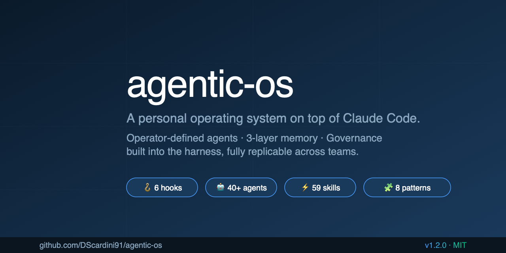

<div align="center">



# 🧬 agentic-os

### A personal operating system on top of Claude Code.

**Agents · Memory · Hooks · Skills · Governance — built into the harness, not improvised per session.**

[](https://github.com/DScardini91/agentic-os/actions/workflows/validate.yml)
[](LICENSE)
[](https://github.com/DScardini91/agentic-os/releases)
[](https://github.com/DScardini91/agentic-os/commits/main)
[](https://docs.claude.com/claude-code)

[**📅 A Monday**](docs/A_MONDAY.md) ·
[**👤 Is this for me?**](docs/WHO_IS_THIS_FOR.md) ·
[**🔒 Data and Privacy**](docs/DATA_AND_PRIVACY.md) ·
[**🧭 Integration Map**](docs/INTEGRATION_MAP.md) ·
[**⏱️ Cost and Maintenance**](docs/COST_AND_MAINTENANCE.md) ·
[**📖 Glossary**](docs/GLOSSARY.md)

[**🪜 Evolution Path**](EVOLUTION_PATH.md) ·
[**📖 Architecture**](ARCHITECTURE.md) ·
[**📋 Done Contract**](DONE_CONTRACT.md) ·
[**📜 Changelog**](CHANGELOG.md) ·
[**🗺️ Roadmap**](ROADMAP.md) ·
[**🤝 Contributing**](CONTRIBUTING.md)

</div>

---

## ⚡ The 30-second pitch

After 3 months of use, this is what changes:

- 🧠 Your decisions **stop drifting** across sessions.
- 📋 You **stop re-explaining** who you are to the model every time.
- 🛡️ Your important commitments **stop losing** to whatever is loudest in the moment.
- 📚 Frameworks from books you read 60 days ago **apply themselves** to today's work.
- 🪞 Your weekly review **compounds** instead of starting from scratch.

It runs on top of [Claude Code](https://docs.claude.com/claude-code), takes ~15 minutes to set up, costs ~$5–40/week in API tokens, and you can walk away in a weekend if it doesn't fit.

> ⚠️ **Not for everyone — by design.** Read [👤 *Is this for me?*](docs/WHO_IS_THIS_FOR.md) before forking.

---

## 📑 Table of contents

- [⚡ The 30-second pitch](#-the-30-second-pitch)
- [📅 What does Monday look like?](#-what-does-monday-look-like)
- [🚀 The 90-second pitch (architecture)](#-the-90-second-pitch-architecture)
- [🎯 Is this for you?](#-is-this-for-you)
- [⚡ Quickstart](#-quickstart)
- [🔒 Where does my data live?](#-where-does-my-data-live)
- [📦 What ships in this repo](#-what-ships-in-this-repo)
- [🏗️ How it works](#️-how-it-works)
- [🧭 Opinionated topology (and how to opt out)](#-opinionated-topology-and-how-to-opt-out)
- [💭 Why I built this](#-why-i-built-this)
- [🎨 Customization](#-customization)
- [📊 Status](#-status)
- [🤝 Contributing](#-contributing)

---

## 📅 What does Monday look like?

If you want to see what this actually feels like before reading about how it works, **start here:**

> 📅 [**A Monday at agentic-os**](docs/A_MONDAY.md) — three narrative vignettes (Rung 4 / 8 / 12) showing a real Monday at three different depths of use. ~12 min read.

That document does what this one can't: shows the **output** of using the system on a real Monday, not the **architecture** that produces it.

---

## 🚀 The 90-second pitch (architecture)

You open Claude Code in this repo. It detects you're new, runs a **10-minute interview** about who you are, how you want to be talked to, and what domains matter — then configures a multi-agent system around your answers. From that point on:

> 🧠 **One interface agent** is the only voice that talks to you. It routes work, coordinates specialists, and never dumps raw model output without filtering.
>
> 🦉 **A senior advisor** pressure-tests anything strategic before it reaches you. Three lenses: behavioral bias, tail risk, accountability alignment. **Never speaks to you directly.**
>
> 🎯 **Domain entry agents** own recurring areas: professional work, finance, learning — whatever you define. Each has its own state, vocabulary, and decision shape.
>
> 🛡️ **Entity guardians** protect what you've decided does not enter the trade-off space. Family time. A craft. A health protocol. They surface concrete observations, never abstractions.
>
> 🧬 **An OS analyst (Darwin)** observes the system over weeks. Surfaces drift. Proposes structural change in a weekly governance pass.
>
> 🚧 **Hooks** run *before every tool fires* — some hard-deny (direct merges to main, writes to declared protected repos without owner agent invoked); others warn-loud (edits to control-plane files without senior-advisor invocation, hub-mandate violations). Deny vs warn is documented per-hook in `.claude/settings.json`; the harness ships in warn-loud mode by default so a fork operator can observe drift before promoting hooks to hard-deny.

The system is opinionated **and the opinions are documented**. Opt out of any of them with a one-line config edit. See [the opt-out section](#-opinionated-topology-and-how-to-opt-out).

---

## 🎯 Is this for you?

<table>
<tr>
<td width="50%" valign="top">

### ✅ You'll like this if you:

- Are a **senior knowledge worker** whose decisions get re-litigated across weeks
- Already use **Claude Code** (or are willing to install it)
- Have **persistent context** in your work (clients, projects, recurring decisions)
- Are comfortable with **a few markdown files** before a setup interview
- Value **deterministic enforcement** over soft reminders
- Tolerate **opinionated systems** — every rule documented, every rule editable

</td>
<td width="50%" valign="top">

### ❌ This is NOT for you if you:

- Want a **chat companion**. This is a workbench, not a relationship
- Need an **out-of-the-box product**. You instantiate this for yourself
- Have **transactional work** — high volume, no persistent context per task
- Operate in **regulated environments** where data residency is hard-constrained ([read this first](docs/DATA_AND_PRIVACY.md))
- Need to **coordinate a team of 8+** through this — single-operator by design
- Won't read documentation. The depth is real

</td>
</tr>
</table>

> 🔎 **Deeper qualifier with archetype matrix and career-stage fit:** [👤 *Who is this for?*](docs/WHO_IS_THIS_FOR.md)

---

## ⚡ Quickstart

### 1️⃣ Clone

```bash
git clone https://github.com/DScardini91/agentic-os.git
cd agentic-os
```

### 2️⃣ Open Claude Code

```bash
claude
```

> ✨ That's it. Claude detects `.bootstrap-pending`, prepares the environment automatically, and asks **five questions** to configure the system around you. Takes ~5 minutes. No shell scripts to run first.

### Optional — validate the harness at any time

```bash
bash scripts/validate-all.sh
```

> 🧪 Full check suite: frontmatter, state coverage, regex fixtures, routing compilers, YAML lint, link integrity. Same suite CI runs on every PR.

### Optional — advanced install (prereq check + harness validation)

```bash
bash scripts/install.sh
```

> 🔍 Verifies prerequisites (`jq`, `python3`, `gh`, `git`), primes routing caches, validates the harness. Not required for standard setup — useful if you want to diagnose environment issues before opening Claude Code.

---

## 🔒 Where does my data live?

Your data lives in **four places** when you use agentic-os:

1. 💻 **Your local machine** (the cloned repo on disk)
2. 🐙 **Your GitHub fork** (if you committed and pushed)
3. 🤖 **Anthropic** (whatever you send to Claude during a session — same as any other Claude Code use)
4. 🔌 **Optional external systems** (Notion, Obsidian — only if you wire them in)

The system **does not silently send anything to anywhere new.** Every byte of "where it goes" is visible in your file system and the git remote you configured.

### Three working postures

| Posture | When to use | What it looks like |
|---|---|---|
| 🌐 **Public-ish operator** | Solo, no client-confidential material | Public fork; daily logs and decisions gitignored |
| 🔐 **Private operator** | Solo with personal-only content | Private fork; everything committed |
| ⚖️ **Regulated operator** | Client confidentiality / compliance | Local-only or organization Git server; `control-plane/memory/` gitignored |

> 📖 **Full pre-fork compliance checklist + per-tier residency table:** [🔒 *Data and Privacy*](docs/DATA_AND_PRIVACY.md)

---

## 🧭 How does this fit with my existing tools?

It does **not replace** Notion, Linear, Outlook, ChatGPT, or whatever you already use. It **complements** them by holding the layer they all leave empty: **your operating discipline across sessions**.

- 📋 **External trackers** (Notion / Linear / Jira) hold *operational state* — active projects, tasks, statuses
- 🧬 **agentic-os** holds *structural state* — identity, decisions, frameworks, governance
- 🤖 **Claude Code** holds *execution* — the session where work actually gets done

> 🧭 **Full surface-by-surface comparison + four operator setup recipes:** [🧭 *Integration Map*](docs/INTEGRATION_MAP.md)

---

## ⏱️ What does this cost me?

Honest budget by rung:

| Rung range | Time/week | API tokens/week | What you get back |
|---|---|---|---|
| 1–3 (setup) | 30 min one-time + 5 min/day | ~$2–5 | Persistent context across sessions |
| 4–7 (foundations) | 10–20 min/week | $5–15 | Decisions stop drifting |
| 8–11 (compounding) | 30–60 min/week | $15–40 | Frameworks apply themselves |
| 12–17 (mastery) | 1–2 hours/week | $40–100 | Reputational risk structurally managed |
| 18–22 (authorship) | 2–4 hours/week | $100–300+ | You're authoring canon others ingest |

The system is designed to **earn back its overhead** at every rung. If at any rung the weekly cost feels like overhead-without-payoff, **stop climbing** (not push harder).

> ⏱️ **Full time + dollar breakdown + when to stop climbing:** [⏱️ *Cost and Maintenance*](docs/COST_AND_MAINTENANCE.md)

---

## 📦 What ships in this repo

<table>
<tr>
<th>Surface</th>
<th>Count</th>
<th>Read first</th>
</tr>
<tr>
<td>🪝 <b>Hooks</b><br/>(<code>.claude/hooks/</code> + <code>settings.json</code>)</td>
<td>6 hook scripts in <code>.claude/hooks/</code>; wired in <code>settings.json</code> as: SessionStart × 6 invocations (calling control-plane scripts), PreToolUse × 4 matchers (Bash/Write/Edit/MultiEdit), PostToolUse × 1 (Agent → <code>log-agent-call</code>), Stop × 2</td>
<td><a href="./.claude/settings.json"><code>.claude/settings.json</code></a></td>
</tr>
<tr>
<td>🛠️ <b>Scripts</b><br/>(<code>control-plane/scripts/</code>)</td>
<td>14 bash + 2 Python (compilers, validators, Darwin signal accumulator, TTL compaction)</td>
<td><a href="./control-plane/scripts/validate-harness.sh"><code>validate-harness.sh</code></a></td>
</tr>
<tr>
<td>⚙️ <b>Configs</b><br/>(<code>control-plane/config/</code>)</td>
<td>3 YAML — spoke-owners, protected-repos, triggers</td>
<td><a href="./control-plane/config/triggers.yaml"><code>triggers.yaml</code></a></td>
</tr>
<tr>
<td>🧠 <b>Memory tiers</b></td>
<td>11 — self · interface-agent · senior-advisor · auto · decisions · daily · observability · darwin · scratchpads · skills · concepts · agent-state</td>
<td><a href="./control-plane/memory/auto/MEMORY.md"><code>memory/auto/MEMORY.md</code></a></td>
</tr>
<tr>
<td>📜 <b>Rules</b></td>
<td>3 — engineering-standards · parallel-session-reconciliation · post-mvp-expansion</td>
<td><a href="./control-plane/rules/engineering-standards.md"><code>engineering-standards.md</code></a></td>
</tr>
<tr>
<td>🎴 <b>Concept cards</b></td>
<td>3 decision frameworks — Dalio · senior-advisor pressure-test · interface operating core</td>
<td><a href="./control-plane/concepts/_cards/walter-pressure-test.md"><code>walter-pressure-test.md</code></a></td>
</tr>
<tr>
<td>📋 <b>Best practices</b></td>
<td>11 universal operating rules — Communication · Engineering · Architecture · Output discipline</td>
<td><a href="./control-plane/best-practices/README.md"><code>best-practices/README.md</code></a></td>
</tr>
<tr>
<td>🧩 <b>Agent patterns</b></td>
<td>8 canonical roles documented as replicable patterns</td>
<td><a href="./control-plane/agent-patterns/README.md"><code>agent-patterns/README.md</code></a></td>
</tr>
<tr>
<td>📐 <b>Agent templates</b></td>
<td>4 instantiable — domain-entry · entity-guardian · orchestrator · fallback</td>
<td><a href="./control-plane/templates/agents/README.md"><code>templates/agents/README.md</code></a></td>
</tr>
<tr>
<td>🤖 <b>Agents</b><br/>(<code>.claude/agents/</code>)</td>
<td>10 shipped — kowalski · walter · darwin · artifact-reviewer · 3 domain entries · 3 entity-guardian examples</td>
<td><a href="./.claude/agents/darwin.md"><code>agents/darwin.md</code></a></td>
</tr>
<tr>
<td>⚡ <b>Skills</b><br/>(<code>.claude/skills/</code>)</td>
<td>13 — os-bootstrap · os-bootstrap-extend · decision-log-entry · pr-review · harness-onboarding · branch-cleanup · darwin-housekeeping · spec-cross-check · memory-consolidate · capture-triage · meeting-to-work-items · ingest-content · ux-critique · expert-interview-guide</td>
<td><a href="./.claude/skills/os-bootstrap/SKILL.md"><code>os-bootstrap/SKILL.md</code></a></td>
</tr>
</table>

---

## 🏗️ How it works



Single interface agent fronts everything. Domain entries own recurring work. Entity guardians protect what you've declared non-negotiable. Senior advisor pressure-tests internally. Quality gate verifies artifacts before delivery. OS analyst observes the system over time and proposes structural change.

### 🚧 The harness enforcement layer



Hooks fire deterministically at **SessionStart**, **PreToolUse**, **PostToolUse**, and **Stop**. The rules you set don't drift across sessions because they're enforced at tool dispatch time, not relied on the model to remember.

> 📖 Read [`ARCHITECTURE.md`](ARCHITECTURE.md) for the full canonical flow, design principles, and the 10 Mermaid diagrams describing each layer.

---

## 🪜 Where do you go from here?

Once bootstrap is done, the system has a **22-rung evolution ladder** in [`EVOLUTION_PATH.md`](EVOLUTION_PATH.md) — grouped into 4 phases:

- 🌱 **Foundations** (Rungs 1–5) — first domain, first decision, first habit
- 🌿 **Compounding** (Rungs 6–11) — second domain, canon ingestion, weekly ritual
- 🌳 **Mastery** (Rungs 12–17) — orchestrators, custom canons, governance rigor
- 🌲 **Authorship** (Rungs 18–22) — books → decisions, multi-school committees, authored canon

Every rung tells you **what you'll have**, **why it matters**, and **Scardini's practice** as a mirror. You stop wherever you want.

> ✨ **Darwin runs in path mode** — invoke the `darwin-path-mode` skill (or ask *"where am I on the ladder?"*) and Darwin reads your current state, surfaces the next 2-3 rungs that are ready + recommended, and **never pushes** beyond what you ask for.

---

## 🧭 Opinionated topology (and how to opt out)

The default topology is **single interface + internal senior advisor + domain spokes + entity guardians + governance analyst**. The enforcement layer (hooks, configs) assumes this shape.

> 💡 **It's a guide rail, not a cage.**

If you want a different topology (flat agents, multi-interface, no senior advisor):

1. 🔧 Clear or rewrite `control-plane/config/spoke-owners.yaml`
2. 🚫 Remove `enforce-hub.sh` from `PreToolUse` in `.claude/settings.json`
3. ⏭️ Skip Blocks 3-4 of `os-bootstrap` and delete `.bootstrap-pending` manually

The harness silent-passes on missing config and keeps running.

---

## 💭 Why I built this

After a year of using Claude Code on consulting work, I noticed a pattern: **the model is brilliant at any single turn, but it drifts across turns and sessions.** The drift compounds in three places:

1. 🧠 It **forgets what I value**
2. 📋 It **forgets what we decided**
3. 🛑 It **bypasses rules I told it to follow** because I told them in plain English and the next session never read that conversation

The solution wasn't a better prompt. It was a **harness**:

- 📚 Structured files the model reads at every session start
- 🪝 Hooks that enforce rules before tools fire
- 🎭 Explicit roles that separate execution from pressure-testing

Once that infrastructure existed, **every session inherited the discipline of every previous session.**

I'm a **Senior Forward Deployed AI Scientist at BCG**. The discipline this repo encodes — single-interface coordination, internal pressure-test before delivery, governance loops, deterministic enforcement — is the same shape I see in well-run client organizations. That isn't accidental. The repo is one way to make an LLM operate that way for you.

---

## 🎨 Customization

Everything in this repo is meant to be edited:

| Surface | What you can do |
|---|---|
| 📋 **Best practices** (`control-plane/best-practices/`) | Delete any rule you disagree with. The `Why` block explains the cost so the deletion is informed. |
| 🤖 **Agents** (`.claude/agents/`) | Rename, repurpose, or delete. `os-bootstrap` offers default names; patterns library shows how to instantiate new ones. |
| 🪝 **Hooks** (`.claude/settings.json`) | Remove a hook by deleting its entry. Override per-invocation via documented env vars (`HARNESS_MERGE_OVERRIDE`, `HARNESS_HUB_OVERRIDE`, `HARNESS_PROTECTED_WRITE_OVERRIDE`). |
| 🌐 **Domains** (`professional/`, `personal/`, ...) | Six example folders ship. Bootstrap asks which to keep. Patterns library shows how to add your own. |
| 🎴 **Concept cards** (`control-plane/concepts/_cards/`) | Drop a markdown file with the canonical frontmatter — the SessionStart compiler picks it up next session. |

---

## 📊 Status

<div align="center">

| Metric | Value |
|---|---|
| 📦 Skills shipped | **13** |
| 🤖 Agents shipped | **10** (all with YAML frontmatter) |
| 🧩 Agent patterns documented | **8** |
| 📋 Universal best practices | **11** |
| 🪝 Hook integrations | **6 hook scripts** wired across SessionStart / PreToolUse / PostToolUse / Stop |
| 🧪 CI checks | **6 (frontmatter, fixtures, compilers, YAML lint, link integrity, regex)** |
| ✅ Status | All CI green |

</div>

---

## 🤝 Contributing

See [`CONTRIBUTING.md`](CONTRIBUTING.md) for how to propose changes, run the validation suite, and the weekly evolution ritual.

Quick links:
- 🐛 [Report a bug](https://github.com/DScardini91/agentic-os/issues/new?template=bug.md)
- ✨ [Propose a pattern / skill](https://github.com/DScardini91/agentic-os/issues/new?template=feature.md)
- ❓ [Ask a question](https://github.com/DScardini91/agentic-os/issues/new?template=question.md)

---

## 📄 License

**MIT.** See [`LICENSE`](LICENSE).

---

<div align="center">

Built by **[Daniel Scardini](https://github.com/DScardini91)** · Senior Forward Deployed AI Scientist · BCG

If this repo helped you, **⭐ star it** — and if you forked it to instantiate your own, **let me know how it went**.

</div>
